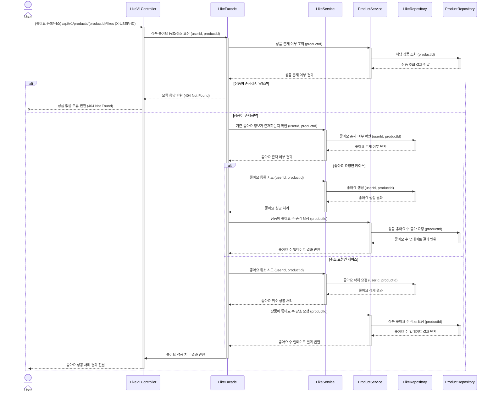
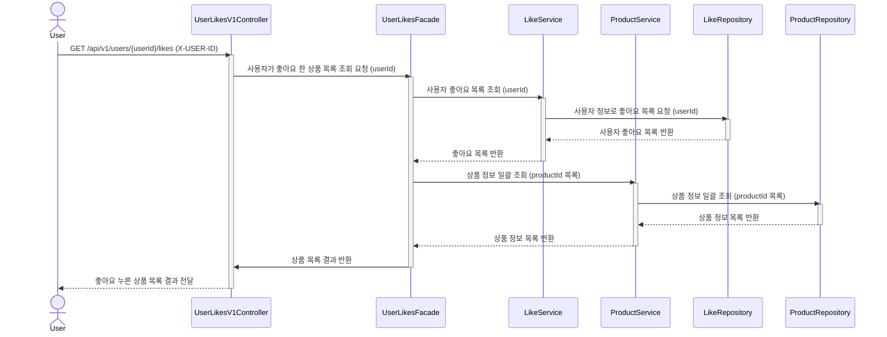
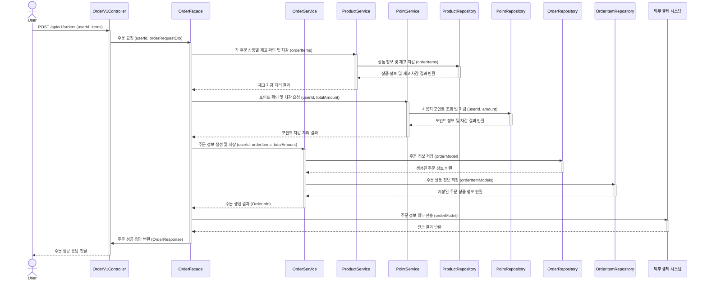

# 시퀀스 다이어그램

---

## 1.좋아요 등록/취소 요청

```mermaid
sequenceDiagram
    actor User
    participant LikeV1Controller
    participant LikeFacade
    participant LikeService
    participant ProductService
    participant LikeRepository
    participant ProductRepository

    User->>LikeV1Controller: (좋아요 등록/취소) /api/v1/products/{productId}/likes (X-USER-ID)
    activate LikeV1Controller
    LikeV1Controller->>LikeFacade: 상품 좋아요 등록/취소 요청 (userId, productId)
    activate LikeFacade
    LikeFacade->>ProductService: 상품 존재 여부 조회 (productId)
    activate ProductService
    ProductService->>ProductRepository: 해당 상품 조회 (productId)
    activate ProductRepository
    ProductRepository-->>ProductService: 상품 조회 결과 전달
    deactivate ProductRepository
    ProductService-->>LikeFacade: 상품 존재 여부 결과
    deactivate ProductService

    alt 상품이 존재하지 않으면
        LikeFacade--xLikeV1Controller: 오류 응답 반환 (404 Not Found)
        LikeV1Controller--xUser: 상품 없음 오류 반환 (404 Not Found)
    else 상품이 존재하면
        LikeFacade->>LikeService: 기존 좋아요 정보가 존재하는지 확인 (userId, productId)
        activate LikeService
        LikeService->>LikeRepository: 좋아요 존재 여부 확인 (userId, productId)
        activate LikeRepository
        LikeRepository-->>LikeService: 좋아요 존재 여부 반환
        deactivate LikeRepository
        LikeService-->>LikeFacade: 좋아요 존재 여부 결과
        deactivate LikeService
        alt 좋아요 요청인 케이스
            LikeFacade->>LikeService: 좋아요 등록 시도 (userId, productId)
            activate LikeService
            LikeService->>LikeRepository: 좋아요 생성 (userId, productId)
            activate LikeRepository
            LikeRepository-->>LikeService: 좋아요 생성 결과
            deactivate LikeRepository
            LikeService-->>LikeFacade: 좋아요 성공 처리
            deactivate LikeService
            LikeFacade->>ProductService: 상품에 좋아요 수 증가 요청 (productId)
            activate ProductService
            ProductService->>ProductRepository: 상품 좋아요 수 증가 요청 (productId)
            activate ProductRepository
            ProductRepository-->>ProductService: 좋아요 수 업데이트 결과 반환
            deactivate ProductRepository
            ProductService-->>LikeFacade: 좋아요 수 업데이트 결과 반환
            deactivate ProductService
        else 취소 요청인 케이스
            LikeFacade->>LikeService: 좋아요 취소 시도 (userId, productId)
            activate LikeService
            LikeService->>LikeRepository: 좋아요 삭제 요청 (userId, productId)
            activate LikeRepository
            LikeRepository-->>LikeService: 좋아요 삭제 결과
            deactivate LikeRepository
            LikeService-->>LikeFacade: 좋아요 취소 성공 처리
            deactivate LikeService
            LikeFacade->>ProductService: 상품에 좋아요 수 감소 요청 (productId)
            activate ProductService
            ProductService->>ProductRepository: 상품 좋아요 수 감소 요청 (productId)
            activate ProductRepository
            ProductRepository-->>ProductService: 좋아요 수 업데이트 결과 반환
            deactivate ProductRepository
            ProductService-->>LikeFacade: 좋아요 수 업데이트 결과 반환
            deactivate ProductService
        end
        LikeFacade->>LikeV1Controller: 좋아요 성공 처리 결과 반환
        deactivate LikeFacade
        LikeV1Controller-->>User: 좋아요 성공 처리 결과 전달
        deactivate LikeV1Controller
    end
```

---

## 2. 사용자가 좋아요 한 상품 목록 조회

```mermaid
sequenceDiagram
    actor  User
    participant UserLikesV1Controller
    participant UserLikesFacade
    participant LikeService
    participant ProductService
    participant LikeRepository
    participant ProductRepository

    User->>UserLikesV1Controller: GET /api/v1/users/{userId}/likes (X-USER-ID)
    activate UserLikesV1Controller
    UserLikesV1Controller->>UserLikesFacade: 사용자가 좋아요 한 상품 목록 조회 요청 (userId)
    activate UserLikesFacade
    UserLikesFacade->>LikeService: 사용자 좋아요 목록 조회 (userId)
    activate LikeService
    LikeService->>LikeRepository: 사용자 정보로 좋아요 목록 요청 (userId)
    activate LikeRepository
    LikeRepository-->>LikeService: 사용자 좋아요 목록 반환
    deactivate LikeRepository
    LikeService-->>UserLikesFacade: 좋아요 목록 반환
    deactivate LikeService
    UserLikesFacade->>ProductService: 상품 정보 일괄 조회 (productId 목록)
    activate ProductService
    ProductService->>ProductRepository: 상품 정보 일괄 조회 (productId 목록)
    activate ProductRepository
    ProductRepository-->>ProductService: 상품 정보 목록 반환
    deactivate ProductRepository
    ProductService-->>UserLikesFacade: 상품 정보 목록 반환
    deactivate ProductService
    UserLikesFacade->>UserLikesV1Controller: 상품 목록 결과 반환
    deactivate UserLikesFacade
    UserLikesV1Controller-->>User: 좋아요 누른 상품 목록 결과 전달
    deactivate UserLikesV1Controller
```

---

## 3. 주문 생성 요청

```mermaid
sequenceDiagram
    actor User
    participant OrderV1Controller
    participant OrderFacade
    participant OrderService
    participant ProductService
    participant PointService
    participant ProductRepository
    participant PointRepository
    participant OrderRepository
    participant OrderItemRepository
    participant PG as 외부 결제 시스템

    User->>OrderV1Controller: POST /api/v1/orders (userId, items)
    activate OrderV1Controller
    OrderV1Controller->>OrderFacade: 주문 요청 (userId, orderRequestDto)
    activate OrderFacade
    OrderFacade->>ProductService: 각 주문 상품별 재고 확인 및 차감 (orderItems)
    activate ProductService
    ProductService->>ProductRepository: 상품 정보 및 재고 차감 (orderItems)
    activate ProductRepository
    ProductRepository-->>ProductService: 상품 정보 및 재고 차감 결과 반환
    deactivate ProductRepository
    ProductService-->>OrderFacade: 재고 차감 처리 결과
    deactivate ProductService
    OrderFacade->>PointService: 포인트 확인 및 차감 요청 (userId, totalAmount)
    activate PointService
    PointService->>PointRepository: 사용자 포인트 조회 및 차감 (userId, amount)
    activate PointRepository
    PointRepository-->>PointService: 포인트 정보 및 차감 결과 반환
    deactivate PointRepository
    PointService-->>OrderFacade: 포인트 차감 처리 결과
    deactivate PointService
    OrderFacade->>OrderService: 주문 정보 생성 및 저장 (userId, orderItems, totalAmount)
    activate OrderService
    OrderService->>OrderRepository: 주문 정보 저장 (orderModel)
    activate OrderRepository
    OrderRepository-->>OrderService: 생성된 주문 정보 반환
    deactivate OrderRepository
    OrderService->>OrderItemRepository: 주문 상품 정보 저장 (orderItemModels)
    activate OrderItemRepository
    OrderItemRepository-->>OrderService: 저장된 주문 상품 정보 반환
    deactivate OrderItemRepository
    OrderService-->>OrderFacade: 주문 생성 결과 (OrderInfo)
    deactivate OrderService
    OrderFacade->>PG: 주문 정보 외부 전송 (orderModel)
    activate PG
    PG-->>OrderFacade: 전송 결과 반환
    deactivate PG
    OrderFacade->>OrderV1Controller: 주문 성공 응답 변환 (OrderResponse)
    deactivate OrderFacade
    OrderV1Controller-->>User: 주문 성공 응답 전달
    deactivate OrderV1Controller
```