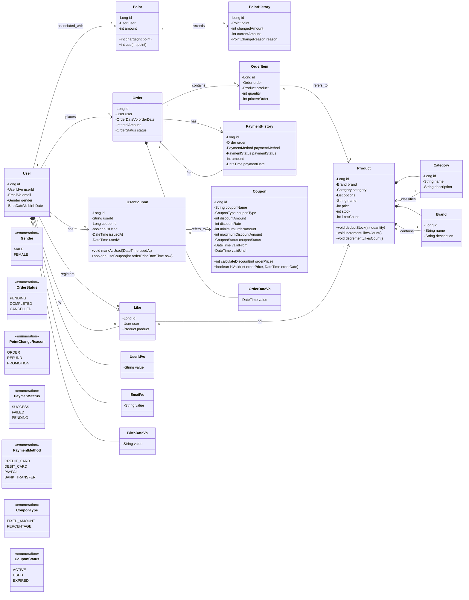

# 클래스 다이어그램

---

```mermaid
classDiagram
    direction LR

    class User {
        -Long id
        -UserIdVo userId
        -EmailVo email
        -Gender gender
        -BirthDateVo birthDate
    }

    class Point {
        -Long id
        -User user 
        -int amount
        +int charge(int point)
        +int use(int point)
    }
    class PointHistory {
        -Long id
        -Point point 
        -int changedAmount 
        -int currentAmount 
        -PointChangeReason reason
    }
    
    class Brand {
        -Long id
        -String name
        -String description
    }
    class Product {
        -Long id
        -Brand brand 
        -Category category 
        -List<ProductOption> options 
        -String name
        -int price
        -int stock
        -int likesCount
        +void deductStock(int quantity)
        +void incrementLikesCount()
        +void decrementLikesCount()
    }

    class Category {
        -Long id
        -String name
        -String description
    }

    class Like {
        -Long id
        -User user 
        -Product product 
    }
    class Order {
        -Long id
        -User user 
        -OrderDateVo orderDate
        -int totalAmount
        -OrderStatus status
    }
    class OrderItem {
        -Long id
        -Order order
        -Product product 
        -int quantity
        -int priceAtOrder
    }
    
    class PaymentHistory {
        -Long id
        -Order order 
        -PaymentMethod paymentMethod
        -PaymentStatus paymentStatus
        -int amount
        -DateTime paymentDate
    }
    
    class Coupon {
        -Long id
        -String couponName
        -CouponType couponType
        -int discountAmount
        -int discountRate
        -int minimumOrderAmount
        -int maximumDiscountAmount
        -CouponStatus couponStatus
        -DateTime validFrom
        -DateTime validUntil
        +int calculateDiscount(int orderPrice)
        +boolean isValid(int orderPrice, DateTime orderDate)
    }
    
    class UserCoupon {
        -Long id
        -String userId
        -Long couponId 
        -boolean isUsed
        -DateTime issuedAt
        -DateTime usedAt
        +void markAsUsed(DateTime usedAt)
        +boolean useCoupon(int orderPriceDateTime now)
    }
    

    %% --- Value Objects ---
    class UserIdVo {
        -String value
    }
    class EmailVo {
        -String value
    }
    class BirthDateVo {
        -String value
    }
    class OrderDateVo {
        -DateTime value
    }

    %% --- Enumerations ---
    class Gender {
        <<enumeration>>
        MALE
        FEMALE
    }
    
    class OrderStatus {
        <<enumeration>>
        PENDING
        COMPLETED
        CANCELLED
    }
    
    class PointChangeReason {
        <<enumeration>>
        ORDER
        REFUND
        PROMOTION
    }
    
    class PaymentStatus {
        <<enumeration>>
        SUCCESS
        FAILED
        PENDING
    }
    
    class PaymentMethod {
        <<enumeration>>
        CREDIT_CARD
        DEBIT_CARD
        PAYPAL
        BANK_TRANSFER
    }
    
    class CouponType {
        <<enumeration>>
        FIXED_AMOUNT
        PERCENTAGE
    }
    
    class CouponStatus {
        <<enumeration>>
        ACTIVE
        USED
        EXPIRED
    }

    User "1" --> "1" Point : associated_with
    User "1" --> "N" Order : places
    User "1" --> "N" Like : registers

    Point "1" --> "N" PointHistory : records

    Brand "1" --> "N" Product : contains
    Category "1" --> "N" Product : classifies

    Order "1" --> "N" OrderItem : contains
    OrderItem "N" --> "1" Product : refers_to
    Order "1" --> "1" PaymentHistory : has
    
    PaymentHistory "1" --> "1" Order : for

    Like "N" --> "1" User : by
    Like "N" --> "1" Product : on

    User *-- UserIdVo
    User *-- EmailVo
    User *-- BirthDateVo
    Order *-- OrderDateVo
    
    Product *-- Category
    Product *-- Brand

    User "1" --> "N" UserCoupon : has   
    UserCoupon "N" --> "1" Coupon : refers_to    


```
