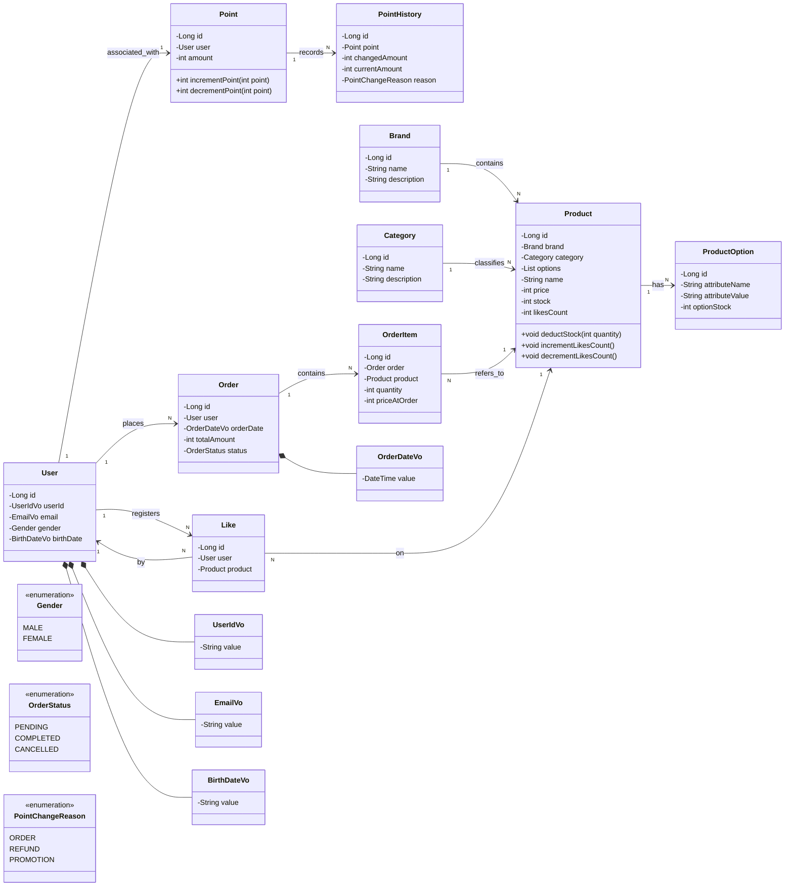

# 클래스 다이어그램

---

```mermaid
classDiagram
    direction LR

    class User {
        -Long id
        -UserIdVo userId
        -EmailVo email
        -Gender gender
        -BirthDateVo birthDate
    }

    class Point {
        -Long id
        -User user 
        -int amount
        +int incrementPoint(int point)
        +int decrementPoint(int point)
    }
    class PointHistory {
        -Long id
        -Point point 
        -int changedAmount 
        -int currentAmount 
        -PointChangeReason reason
    }
    
    class Brand {
        -Long id
        -String name
        -String description
    }
    class Product {
        -Long id
        -Brand brand 
        -Category category 
        -List<ProductOption> options 
        -String name
        -int price
        -int stock
        -int likesCount
        +void deductStock(int quantity)
        +void incrementLikesCount()
        +void decrementLikesCount()
    }

    class ProductOption {
        -Long id
        -String attributeName
        -String attributeValue
        -int optionStock
    }

    class Category {
        -Long id
        -String name
        -String description
    }

    class Like {
        -Long id
        -User user 
        -Product product 
    }
    class Order {
        -Long id
        -User user 
        -OrderDateVo orderDate
        -int totalAmount
        -OrderStatus status
    }
    class OrderItem {
        -Long id
        -Order order
        -Product product 
        -int quantity
        -int priceAtOrder
    }

    %% --- Value Objects ---
    class UserIdVo {
        -String value
    }
    class EmailVo {
        -String value
    }
    class BirthDateVo {
        -String value
    }
    class OrderDateVo {
        -DateTime value
    }

    %% --- Enumerations ---
    class Gender {
        <<enumeration>>
        MALE
        FEMALE
    }
    
    class OrderStatus {
        <<enumeration>>
        PENDING
        COMPLETED
        CANCELLED
    }
    
    class PointChangeReason {
        <<enumeration>>
        ORDER
        REFUND
        PROMOTION
    }

    User "1" --> "1" Point : associated_with
    User "1" --> "N" Order : places
    User "1" --> "N" Like : registers

    Point "1" --> "N" PointHistory : records

    Brand "1" --> "N" Product : contains
    Category "1" --> "N" Product : classifies

    Product "1" --> "N" ProductOption : has

    Order "1" --> "N" OrderItem : contains
    OrderItem "N" --> "1" Product : refers_to

    Like "N" --> "1" User : by
    Like "N" --> "1" Product : on

    User *-- UserIdVo
    User *-- EmailVo
    User *-- BirthDateVo
    Order *-- OrderDateVo
```