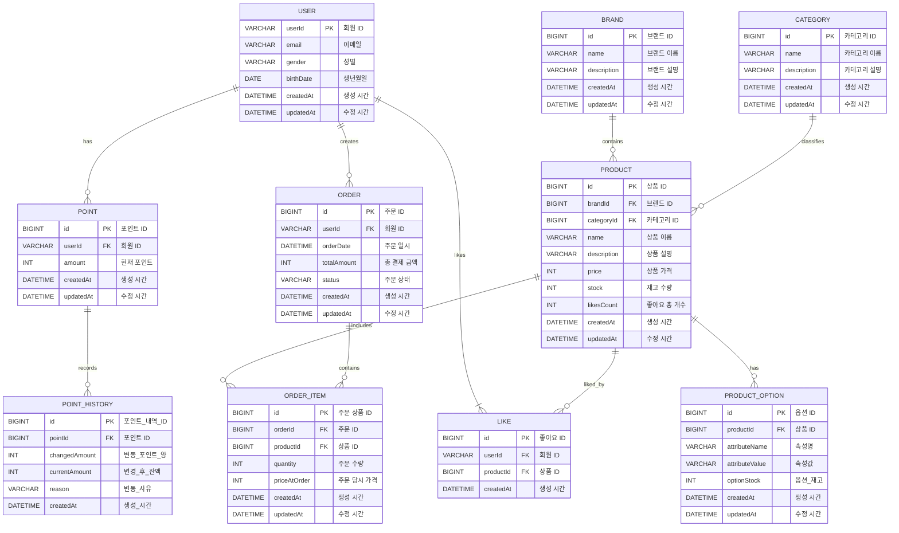

# ERD
---

```mermaid
erDiagram

    USER {
        VARCHAR userId PK "회원 ID"
        VARCHAR email "이메일"
        VARCHAR gender "성별"
        DATE birthDate "생년월일"
        DATETIME createdAt "생성 시간"
        DATETIME updatedAt "수정 시간"
    }

    POINT {
        BIGINT id PK "포인트 ID"
        VARCHAR userId FK "회원 ID"
        INT amount "현재 포인트"
        DATETIME createdAt "생성 시간"
        DATETIME updatedAt "수정 시간"
    }

    POINT_HISTORY {
        BIGINT id PK "포인트_내역_ID"
        BIGINT pointId FK "포인트 ID"
        INT changedAmount "변동_포인트_양"
        INT currentAmount "변경_후_잔액"
        VARCHAR reason "변동_사유"
        DATETIME createdAt "생성_시간"
    }

    BRAND {
        BIGINT id PK "브랜드 ID"
        VARCHAR name "브랜드 이름"
        VARCHAR description "브랜드 설명"
        DATETIME createdAt "생성 시간"
        DATETIME updatedAt "수정 시간"
    }

    PRODUCT {
        BIGINT id PK "상품 ID"
        BIGINT brandId FK "브랜드 ID"
        BIGINT categoryId FK "카테고리 ID"
        VARCHAR name "상품 이름"
        VARCHAR description "상품 설명"
        INT price "상품 가격"
        INT stock "재고 수량"
        INT likesCount "좋아요 총 개수"
        DATETIME createdAt "생성 시간"
        DATETIME updatedAt "수정 시간"
    }

    PRODUCT_OPTION {
        BIGINT id PK "옵션 ID"
        BIGINT productId FK "상품 ID"
        VARCHAR attributeName "속성명"
        VARCHAR attributeValue "속성값"
        INT optionStock "옵션_재고"
        DATETIME createdAt "생성 시간"
        DATETIME updatedAt "수정 시간"
    }

    CATEGORY {
        BIGINT id PK "카테고리 ID"
        VARCHAR name "카테고리 이름"
        VARCHAR description "카테고리 설명"
        DATETIME createdAt "생성 시간"
        DATETIME updatedAt "수정 시간"
    }

    LIKE {
        BIGINT id PK "좋아요 ID"
        VARCHAR userId FK "회원 ID"
        BIGINT productId FK "상품 ID"
        DATETIME createdAt "생성 시간"
    }

    ORDER {
        BIGINT id PK "주문 ID"
        VARCHAR userId FK "회원 ID"
        DATETIME orderDate "주문 일시"
        INT totalAmount "총 결제 금액"
        VARCHAR status "주문 상태"
        DATETIME createdAt "생성 시간"
        DATETIME updatedAt "수정 시간"
    }

    ORDER_ITEM {
        BIGINT id PK "주문 상품 ID"
        BIGINT orderId FK "주문 ID"
        BIGINT productId FK "상품 ID"
        INT quantity "주문 수량"
        INT priceAtOrder "주문 당시 가격"
        DATETIME createdAt "생성 시간"
        DATETIME updatedAt "수정 시간"
    }

    USER ||--o{ POINT : has
    USER ||--o{ ORDER : creates
    USER ||--|{ LIKE : likes

    POINT ||--o{ POINT_HISTORY : records

    BRAND ||--o{ PRODUCT : contains
    CATEGORY ||--o{ PRODUCT : classifies

    PRODUCT ||--o{ PRODUCT_OPTION : has
    PRODUCT ||--o{ ORDER_ITEM : includes
    PRODUCT ||--o{ LIKE : liked_by

    ORDER ||--o{ ORDER_ITEM : contains

```